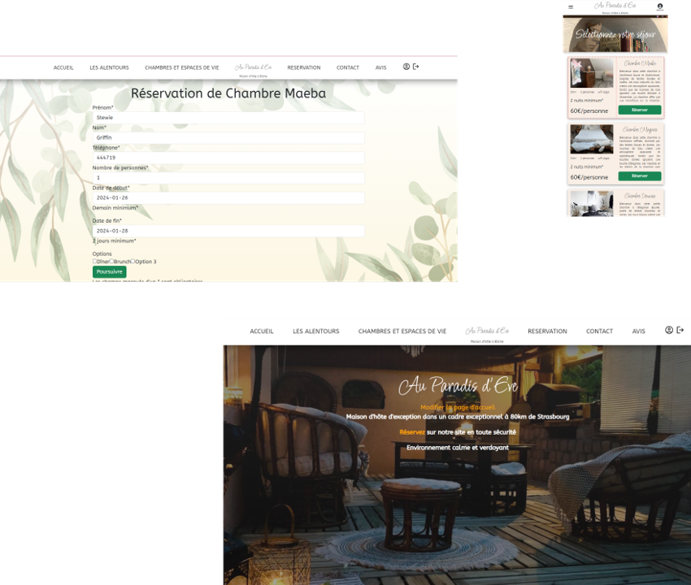

# Au Paradis d'Eve

## Environnement de travail

- **Symfony 6**
  - Lancer la commande suivante pour installer les dépendances :
    ```bash
    composer install
    ```

- **MySQL**
  - Installer [Scoop sh](https://scoop.sh/):
    ```powershell
    Set-ExecutionPolicy -ExecutionPolicy RemoteSigned -Scope CurrentUser
    Invoke-RestMethod -Uri https://get.scoop.sh | Invoke-Expression
    ```
    
  - Installer Symfony CLI avec la commande suivante (pour Windows) :
    ```powershell
    scoop install symfony-cli
    ```

## Bundles à installer

### MailHost
- Télécharger l'exécutable de [MailHog](https://github.com/mailhog/MailHog/releases/tag/v1.0.1) et l'exécuter (laisser tourner en arrière-plan si besoin de tester les e-mails).
  ![MailHog]
### Dompdf
- Lancer la commande suivante pour installer Dompdf :
  ```bash
  composer require dompdf/dompdf

## Aperçu
[]
